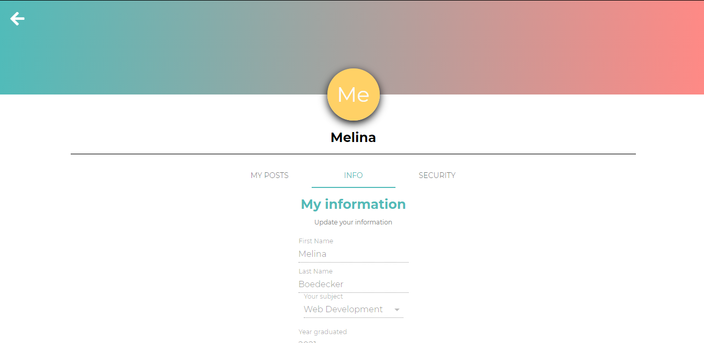

# AlumSpace

[](https://opensource.org/licenses/MIT) 

## Description
A social networking app for coding bootcamp Alumni to share their ideas, sucess stories, job postings, and ask for help.

## Technologies

This application uses the MERN stack ([MongoDB](https://www.mongodb.com/), [Express.js](https://expressjs.com/), [React](https://reactjs.org/), [Node.js](https://nodejs.org/en/)), [GraphQL](https://graphql.org/), and [MaterialUI](https://material-ui.com/).

## Table of Contents: 
* [Installation](#installation)
* [Usage](#usage) 
* [License](#license) 
* [Contributing](#contributing) 
* [Questions](#questions) 

## Installation: 

To run locally:

* You will need to have Node.js and MongoDB installed. 
* After cloning the repo, run ```npm install``` in your bash terminal to install the dependencies.  Then run ```npm install graphql```
* Be sure to log into mongod. 
* Run ```npm run develop``` to initialize both the front and back end servers on your local machine, then go to localhost:3000 in your browser. 


 
## Usage: 
[Click here for deployed app](https://alumnspace.herokuapp.com/)   

On the Home page you can either click the **Login** or **Signup** buttons to log in or register.  You must be registered and logged in to use the site.  Once logged in, you will see all of the posts with the newest posts on the top.  You can use the search feature find posts with particular category and/or label as well as specific text in the title.  Put your text in the search field and use the **category** and **label** drop down fields if you wish then hit the **search** button and the relevant posts will be listed below.   

When you click on an individual post from the list you will be able to view the entirety of the post text along with the comments.  Click on the broken heart icon to like the post and the icon will change to an unbroken heart.  If you change your mind and want to un-like the post, you can click the heart icon and it will change back to the broken heart icon. Click on the blue comment icon to add a comment.  

To create a new post, click **Create Post** in the Navbar.  Enter a title, choose an appropriate category and label, add your post to the body section then click the **Post** button below. 

To view your own posts or view and change your user information, click on **Profile** in the Navbar. Then click on **My Posts** to see a list of your posts.  Click on **Info** to view and make any changes to your profile information.  There is a back button on the upper left that will take you back to the main page that lists all posts.  

Click on **Home** in the Navbar to return to the list of all posts.  

Click **Logout** in the Navbar to log out. 





## License: 
Licensed under the [MIT](https://opensource.org/licenses/MIT) license. 

## Contributing: 
Feel free to contact me to contribute to this project. My contact information is listed below.


If you have any questions or suggestions, please contact me at <YOUR EMAIL HERE>. 
